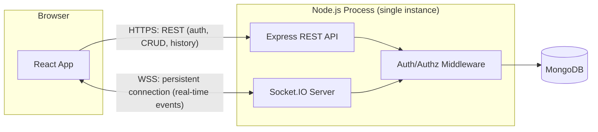
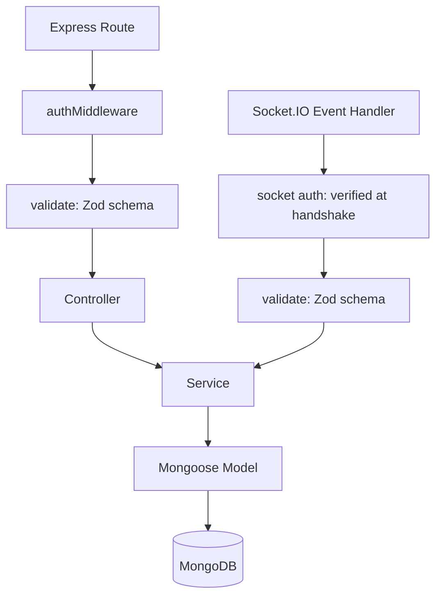
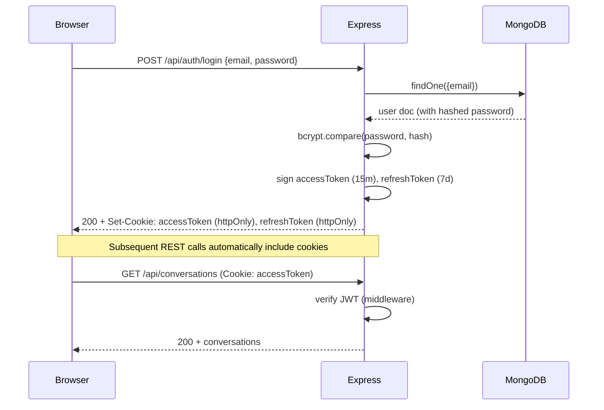
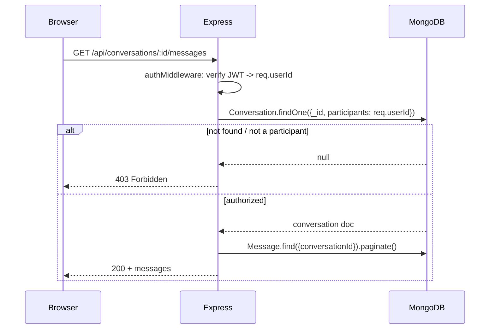
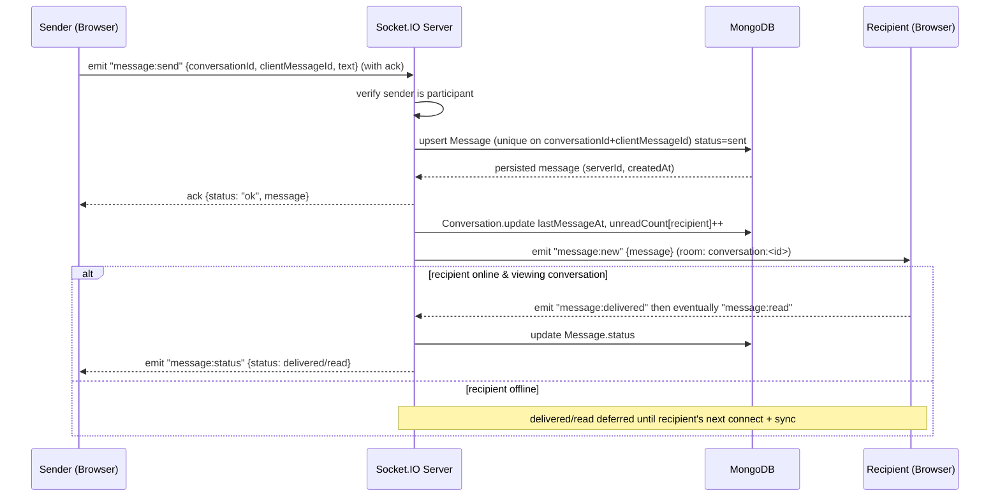
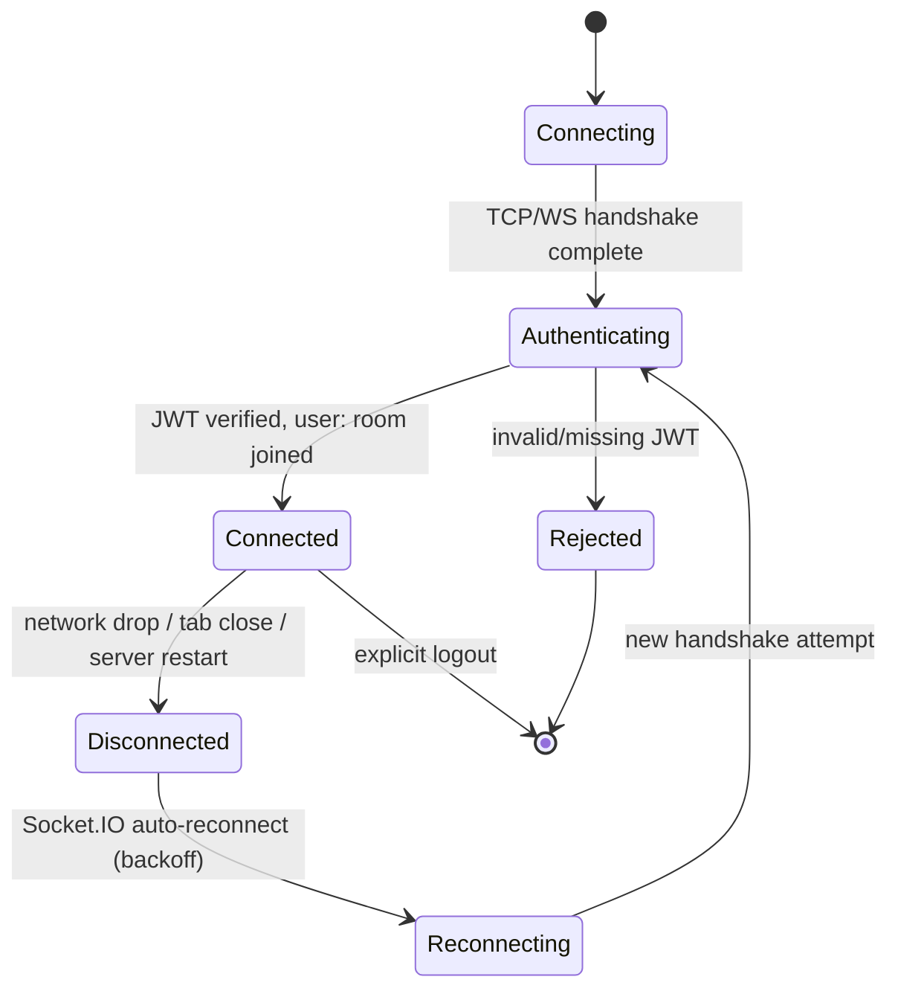
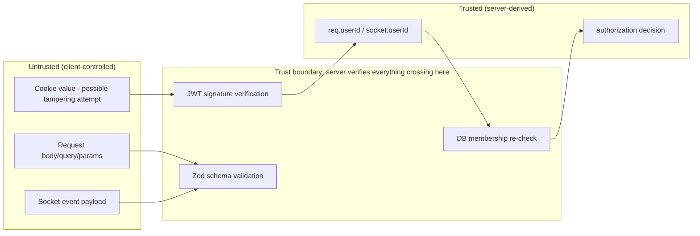

# ARCHITECTURE.md — System Architecture

Related concepts: [[REST API]] [[Socket.IO]] [[WebSocket]] [[Authentication]] [[Authorization]] [[MongoDB]]

## 1. High-Level Architecture

One Node.js process hosts **both** the Express HTTP server and the Socket.IO server (Socket.IO attaches to the same HTTP server instance). They share the same MongoDB connection pool and the same auth-verification logic, but are responsible for different things:

| Concern | Owner |
|---|---|
| Account creation, login, logout, token issuance | REST (Express) |
| Profile read/update, user search | REST (Express) |
| Conversation creation/listing, message history (pagination) | REST (Express) |
| Real-time message delivery, typing, presence, read receipts | Socket.IO |
| Durable persistence of users, conversations, messages | MongoDB |

## 2. HTTP Request/Response vs. Persistent Socket.IO Connection

**HTTP (REST)** is a *request/response* protocol: the client opens a connection, sends one request, gets one response, and (with keep-alive) the underlying TCP connection may be reused, but each REST call is logically independent and stateless from the server's perspective (beyond the JWT it carries). REST is the right fit for anything that is *fetch this data* or *perform one discrete action*: register, log in, load conversation list, load a page of message history.

**Socket.IO** establishes a **long-lived, bidirectional connection** (WebSocket where available, falling back to HTTP long-polling) that stays open for the lifetime of the client's session. Either side can push a message to the other at any time without the other side asking first. This is the right fit for *server-initiated* events the client can't predict or poll for efficiently: "a new message arrived," "the other user started typing," "the other user just went offline."

**Why not do everything over REST with polling?** Polling means the client repeatedly asks "anything new?" — wasteful (most polls return nothing), and adds latency up to the poll interval. **Why not do everything over sockets, including auth and history?** Sockets are worse for simple request/response work: no native HTTP semantics (status codes, caching, REST tooling), harder to test/curl, and mixing "fetch a page of 50 messages" into the same channel as low-latency events adds needless complexity and head-of-line blocking risk. Splitting responsibilities keeps each half doing what it's naturally good at — this is itself an interview-worthy point (see REALTIME.md §"Why Socket.IO instead of polling").

## 3. Frontend Architecture (summary — full detail in FRONTEND.md)

React SPA (Vite). Three kinds of state, kept deliberately separate:

- **Server state** (conversation list, message history, user profile) — fetched via REST, cached with TanStack Query.
- **Client/UI state** (active conversation, modal open, form input) — local component state / Zustand.
- **Real-time state** (presence, typing, live message stream, delivery/read updates) — owned by a Socket.IO context that reconciles into the same stores server state lives in, never a separate parallel source of truth.

## 4. Backend Architecture (summary — full detail in BACKEND.md)

Layered Express app: `routes → controllers → services → models`. Socket.IO handlers live in a parallel `sockets/` layer that calls into the **same services** as the REST controllers where logic overlaps (e.g., persisting a message), so business rules are never duplicated between the two transports.

## 5. Database Architecture (summary — full detail in BACKEND.md)

Three collections: `User`, `Conversation`, `Message`. MongoDB chosen over a relational store — see decision log §12.

- `Conversation` documents store the two participant IDs plus denormalized fields (`lastMessageAt`, `lastMessagePreview`, per-participant `unreadCount`) so the conversation list can be rendered with a single indexed query, no aggregation join needed on the hot path.
- `Message` documents are the append-only, authoritative record of chat content, referencing their `conversationId`.

## 6. REST API Architecture

Resource-oriented (`/api/auth/*`, `/api/users/*`, `/api/conversations/*`). Every route (except `/api/auth/register` and `/api/auth/login`) requires a valid JWT. Every conversation/message route additionally re-verifies the requester is a participant. Full endpoint table in BACKEND.md.

## 7. Socket.IO Architecture

- One Socket.IO server attached to the same HTTP server as Express (same port, same TLS termination in production).
- Authentication happens once, at handshake (`io.use(...)` middleware reading the JWT from the cookie header) — not per-event.
- Rooms: `conversation:<conversationId>` (one per conversation the user is a participant of) and `user:<userId>` (one per user, joined on every connection, used to target all of that user's tabs/devices for presence/notification-style events without needing to know their conversation set in advance).
- Full event table, payload contracts, and flow diagrams in REALTIME.md.

## 8. Authentication Flow

Token refresh: when `accessToken` is expired but `refreshToken` is valid, a dedicated `POST /api/auth/refresh` endpoint issues a new `accessToken`. The frontend's API layer transparently retries a request once after a 401 triggers a refresh (documented in FRONTEND.md).

## 9. Authorization Flow

The same pattern (verify JWT → re-check DB membership using the authenticated `userId`, never a client-claimed one) applies identically inside Socket.IO event handlers before joining a room or persisting/broadcasting a message.

## 10. Message Lifecycle

Key guarantee: the message is durably persisted (step "upsert Message") **before** the sender receives a success ack. If persistence fails, the ack reports failure and the client can safely retry using the *same* `clientMessageId` — the unique index makes the retry idempotent (no duplicate). See REALTIME.md §Idempotency.

**The two steps after the ack — `Conversation` metadata update and the `message:new` broadcast — are independent of each other and of the ack itself (resolved 2026-08-31):** once the ack has been sent, nothing that happens afterward can turn it into a failure from the sender's point of view. A metadata-update failure leaves the message safely persisted but the conversation-list preview briefly stale (self-healing on the next message, or on demand from a list refetch — an accepted, documented inconsistency window, not silently ignored). A broadcast failure is isolated in its own `try/catch` and recovered via the reconnection/history-sync path for whichever client missed it live. See REALTIME.md §12a and BACKEND.md §13b/§13d for the exact mechanisms.

## 11. Conversation Lifecycle

1. User A searches for User B (`GET /api/users/search?q=...`) — no conversation created yet.
2. User A opens a chat with User B: `POST /api/conversations` `{participantId: B}`.
3. Server checks for an existing conversation with exactly `{A, B}` as participants (via a unique compound index on a sorted participant pair). If found, returns it (idempotent). Otherwise creates a new `Conversation` document — and if a second, concurrent request races this one and hits the same unique index, the loser catches the resulting duplicate-key error and re-fetches rather than failing (BACKEND.md §13a), so the invariant "exactly one conversation per pair" holds even under concurrent creation attempts, not just sequential ones.
4. Both users' clients join the socket room `conversation:<id>` when the conversation is opened in the UI (room membership is re-verified server-side against DB participation on join, not trusted from the client).

## 12. Connection Lifecycle

## 13. Reconnection Lifecycle

On reconnect, the client re-authenticates (cookie is sent again automatically on the new handshake) and then runs a **sync step**: for the currently-open conversation, it requests any messages with `createdAt`/`_id` after the last message it has locally (`GET /api/conversations/:id/messages?after=<lastMessageId>`). For the conversation list overall, it simply refetches the list (cheap, small payload, guarantees correctness over a delta-sync optimization that isn't needed at this scale). Full detail and failure-mode table in REALTIME.md.

## 14. Offline Synchronization

There is no message queue holding events for offline users. Because MongoDB is authoritative, "offline sync" is just "the client is behind the database" — solved by the same pagination/`after` mechanism used for reconnection, run once when a conversation is opened or the app regains focus/connectivity. This avoids needing any separate offline-delivery infrastructure (no Redis-backed queue, no push service) while still guaranteeing no message is ever lost.

## 15. Error Flow

- REST: controller/service throws a typed `AppError` (with `statusCode`, `code`, `message`) → caught by centralized Express error middleware → consistent JSON error response.
- Socket.IO: handler wraps logic in try/catch → on failure, calls the ack callback with `{ok: false, error: {code, message}}` (for acked events) and/or emits a scoped `error` event to the socket (for fire-and-forget events) → never throws uncaught inside a socket handler (which would only log server-side and leave the client hanging).

## 16. Security Boundaries

Nothing that crosses from the browser into server logic (HTTP body, query, params, cookie contents, socket payload) is trusted until it has passed through: (1) JWT verification to establish *who* is asking, (2) schema validation to establish the *shape* of what they're asking, and (3) a DB-backed membership check to establish *whether they're allowed*. All three are mandatory on every conversation/message-touching operation — no shortcut path skips any of them.

**Existence-leak tradeoff, made explicit (resolved 2026-08-31):** conversation-scoped routes/events return distinct `403 FORBIDDEN` (exists, not a participant) vs. `404`/`NOT_FOUND` (no such conversation) codes — CLAUDE.md §8's default is 403-not-404 specifically to avoid this kind of leak, but its own escape clause permits a documented exception, and this project takes it deliberately rather than by omission: `Conversation` and `Message` ids are MongoDB `ObjectId`s (12 bytes, effectively unguessable, not sequential), so distinguishing "exists" from "doesn't exist" gives an attacker no practical enumeration capability — they'd need the id already, at which point membership (not existence) is the actual control that matters. Masking existence uniformly (always 403, never 404, or vice versa) was considered and rejected as added complexity with no real confidentiality gain here. If ids ever became guessable/sequential, or the app added enumeration-sensitive resources, this would need revisiting.

## 17. Scaling Considerations (documented, not implemented)

The MVP runs as a **single Node.js process** with in-memory presence tracking (`userId → Set<socketId>`) local to that process. This is intentional for interview scope: it's simple, fully explainable, and correct at single-instance scale.

**If this needed to scale horizontally** (multiple Node instances behind a load balancer):
- In-memory presence maps would need to move to a shared store (Redis) since a user's two socket connections could land on different instances.
- Socket.IO's built-in Redis adapter (`@socket.io/redis-adapter`) would handle cross-instance room broadcast (so `io.to("conversation:x").emit(...)` reaches sockets connected to *any* instance, via Redis pub/sub).
- Sticky sessions (or Socket.IO's stateless reconnection) would be needed at the load balancer for WebSocket upgrade requests.
- MongoDB remains the source of truth regardless of instance count — no change needed there.

This is deliberately **not implemented now** (would violate the "no unnecessary infrastructure" principle) but should be stated clearly in an interview as "here's the exact next step and why," which is a stronger signal than having pre-built infrastructure with no load to justify it.

## 18. Architecture Decision Log

### Decision: MongoDB over PostgreSQL
**WHY:** Chat data is document-shaped (a message is a self-contained record; a conversation is a small document with light structure) with access patterns dominated by "insert a message" and "paginate messages in one conversation" — no complex multi-table joins are needed. Mongoose gives fast iteration and schema flexibility while we're still shaping the model.
**ALTERNATIVES:** PostgreSQL (relational, strong consistency, excellent for the User/Conversation/Message relations too, since they're not actually that relational-averse).
**TRADEOFF:** MongoDB gives simpler horizontal read scaling and flexible schema evolution at the cost of weaker cross-document transactional guarantees (mitigated here by keeping the operations that matter — message insert + conversation counter update — either single-document atomic updates or accepted as eventually-consistent denormalization, documented per-operation in BACKEND.md). PostgreSQL would give stronger consistency out of the box at the cost of needing explicit joins/migrations for a schema that's still evolving.
**INTERVIEW EXPLANATION:** "I chose MongoDB because messages are naturally document-shaped and the dominant query pattern is insert + paginate-by-conversation, which MongoDB indexes serve well. I accepted eventual consistency on denormalized counters (like unread count) in exchange for not needing multi-table transactions for the hot path, and I can explain exactly where that tradeoff shows up."

### Decision: Socket.IO over raw WebSocket
See full treatment in REALTIME.md §"Why Socket.IO was selected."

### Decision: JWT (stateless) over server-side sessions
**WHY:** A single-instance app with no horizontal scaling requirement doesn't need a shared session store; JWT keeps the auth check self-contained (verify signature, no DB round-trip) which is simpler to reason about and matches how most modern REST/real-time hybrid apps are actually built.
**ALTERNATIVES:** Server-side sessions (`express-session` + a session store).
**TRADEOFF:** JWT is harder to *revoke* instantly (a stolen token remains valid until expiry unless a revocation list is added) — mitigated by short-lived access tokens (15 min) plus a refresh token that *can* be revoked server-side, checked against a `Session` record per device (BACKEND.md §6a; resolved 2026-08-31 — an earlier draft floated either a `RefreshToken` record or a single `tokenVersion` field on `User` as alternatives without picking one, which turned out to matter: a single per-user counter would invalidate every device's refresh token on any one device's logout, breaking multi-device support. The per-session record is the one that actually delivers "revoke just this device" without also delivering "revoke every device by accident.") Sessions give instant revocation but require sticky sessions or a shared store to scale horizontally — the `Session` collection here is *not* that (it's a revocation record looked up only at refresh time, not a per-request session store), so this doesn't reintroduce the horizontal-scaling cost server-side sessions would have.
**INTERVIEW EXPLANATION:** "I use short-lived JWT access tokens plus a revocable refresh token, tracked one `Session` document per device rather than a single per-user counter — that's what lets me revoke one compromised device without logging the user out everywhere else, and I can walk through exactly how both single-device and logout-all revocation work."

### Decision: httpOnly cookies over localStorage for token storage
**WHY:** `localStorage` is readable by any JavaScript running on the page — a single XSS vulnerability anywhere in the app (including a third-party script) can exfiltrate the token. An `httpOnly` cookie is never exposed to JavaScript at all, so XSS alone can't steal it.
**ALTERNATIVES:** `localStorage`/`sessionStorage` with the token attached manually via an `Authorization` header.
**TRADEOFF:** httpOnly cookies require CSRF protection (since the browser attaches cookies automatically to any request, including cross-site ones). This app has no cross-site entry flow — no OAuth redirect, no third-party embed, frontend and backend are treated as the same site — so `SameSite=Strict` is used and no separate CSRF token scheme is needed: `Strict` alone prevents the browser from attaching the cookie on any cross-site request, which closes the CSRF vector directly. (`Lax` would only be needed if a cross-site redirect had to carry the session, e.g. a third-party OAuth callback — not the case here, and not planned; if that ever changes, this decision must be revisited alongside adding CSRF tokens.) `localStorage` avoids CSRF entirely but is fully exposed to XSS. Given message content is user-generated text (an XSS-relevant surface), the cookie approach's threat model is the better fit here.
**INTERVIEW EXPLANATION:** "I chose httpOnly, SameSite=Strict cookies specifically because this app renders user-generated content, which is exactly the kind of app where an XSS bug is most likely — and I don't want a single XSS bug to also mean full account takeover via a stolen token. Strict works cleanly because there's no cross-site redirect flow in this app; I know that's the exact condition that would force me to switch to Lax plus CSRF tokens."

### Decision: No Redis / message queue in MVP
**WHY:** Single-instance deployment target; adding Redis now would be infrastructure with no load to justify it, contradicting the project's "no unnecessary infrastructure" principle.
**ALTERNATIVES:** Redis-backed Socket.IO adapter + presence store from day one.
**TRADEOFF:** Accepting that presence state resets on restart and that the app can't horizontally scale as-is, in exchange for a system that's fully explainable without invoking infrastructure that isn't earning its keep yet.
**INTERVIEW EXPLANATION:** "I know exactly what I'd add (Redis adapter, shared presence store) and why, but I didn't add it because there's no scale requirement driving it yet — I can explain the exact trigger that would make it worth adding."
